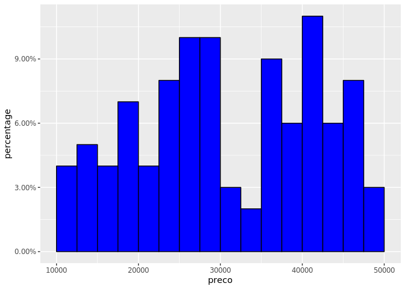

Demonstração de Histograma
================
Ricardo Lacerda e Dan Reznik
20 de Abril de 2019

Carrega bibliotecas

``` r
library(tidyverse)
library(scales)
```

Cria dataframe com uma coluna com 100 preços aleatórios

``` r
set.seed(0)
df <- tibble(preco=runif(100,min=10000,max=50000))
```

Plota histograma da frequencia percentual:

``` r
df %>%
  ggplot(aes(preco)) +  
  geom_histogram(aes(y = stat(width*density)),
                 breaks=seq(10000,50000,2500),fill="blue",color="black") +
  scale_y_continuous(labels = percent_format()) +
  labs(y="percentage")
```


